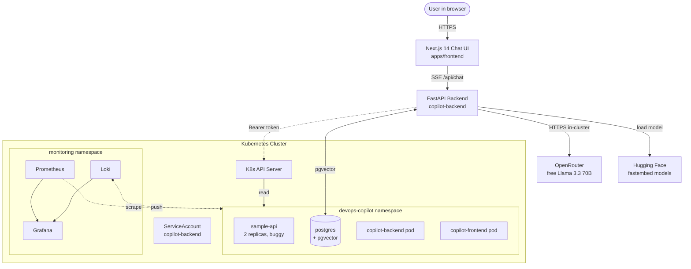
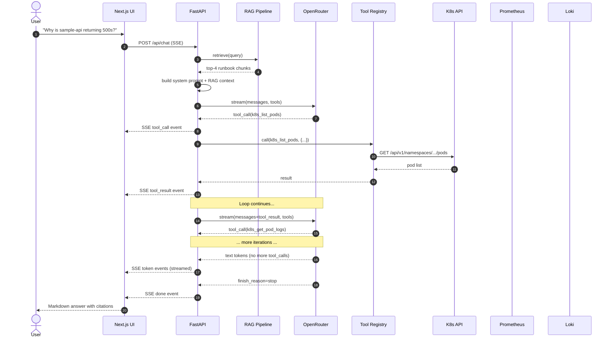
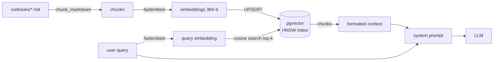
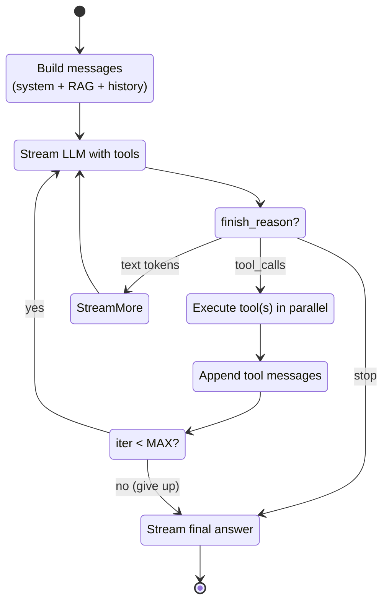
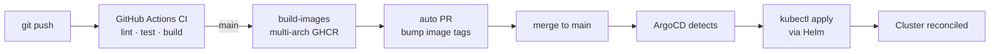
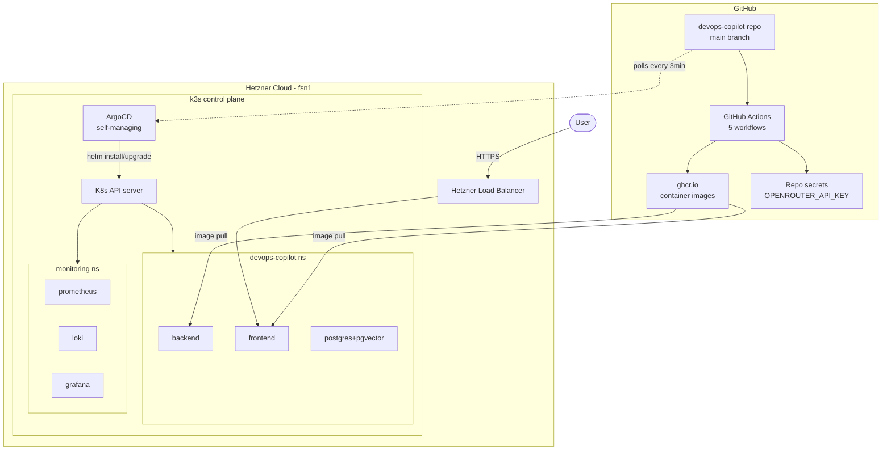

# Architecture

Detailed architecture diagrams for the DevOps Copilot. See [README.md](../README.md) for the short version.

## System overview



## Request flow (one chat message)



## RAG pipeline



## Agent loop (the heart of Day 5)



## CI/CD flow



## Component map (files)

```
copilot-backend/app/
├── main.py              FastAPI app + lifespan (connects everything)
├── config.py            Pydantic settings
├── llm.py               OpenRouter client (streaming + tool calls)
├── embeddings.py        fastembed (BAAI/bge-small-en-v1.5)
├── vectorstore.py       asyncpg + pgvector + HNSW
├── chunker.py           markdown-aware chunker
├── rag.py               RAG orchestration
├── models.py            Pydantic request/response models
├── tools/               Tool implementations
│   ├── base.py          Tool ABC + ToolRegistry
│   ├── k8s.py           4 K8s tools (read-only)
│   ├── prometheus.py    2 PromQL tools
│   ├── loki.py          1 LogQL tool
│   └── registry.py      build_registry() factory
└── api/                 FastAPI routes
    ├── chat.py          Agent loop with SSE
    ├── health.py        Health/readiness
    └── ingest.py        Manual re-ingestion endpoint

apps/frontend/
├── app/                 Next.js App Router
│   ├── layout.tsx       Root layout
│   ├── page.tsx         Home (renders <Chat/>)
│   └── globals.css      Tailwind + custom
├── components/
│   ├── chat.tsx         Main chat container
│   ├── message.tsx      Markdown bubble + tool calls + citations
│   ├── tool-call.tsx    Amber collapsible card
│   ├── suggestions.tsx  6 demo prompts on empty state
│   ├── typing-indicator.tsx
│   └── ui/              shadcn-style primitives
└── lib/
    ├── api.ts           SSE consumer (ReadableStream)
    ├── types.ts         Shared types
    ├── utils.ts         cn() helper (clsx + twMerge)
    └── prompts.ts       Suggestion chips

helm/devops-copilot/
├── Chart.yaml           Chart metadata
├── values.yaml          200+ lines of config
└── templates/           12 templates
    ├── _helpers.tpl     Naming + labels
    ├── backend.yaml     Deployment + Service + HPA + NetPol + ServiceMonitor
    ├── frontend.yaml    Deployment + Service + Ingress
    ├── postgres.yaml    Deployment + PVC + Service
    ├── configmap.yaml   All env vars
    ├── secret.yaml      OpenRouter key + Postgres creds
    ├── runbooks-configmap.yaml
    ├── rbac.yaml        ServiceAccount + ClusterRole + Binding
    ├── serviceaccount.yaml
    ├── resources.yaml   ResourceQuota + PDB
    ├── postgres-init-configmap.yaml
    └── NOTES.txt        Post-install instructions
```

## Deployment topology (Hetzner Cloud + ArgoCD)


